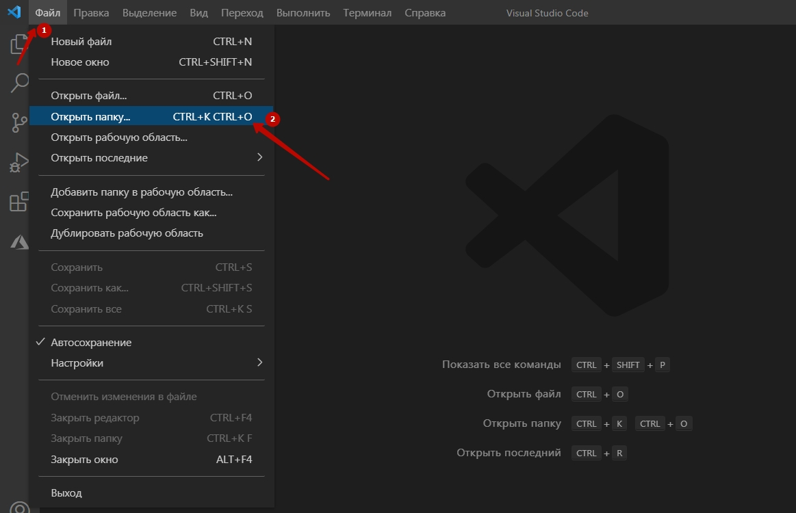

## Старт работы с Python
Для начала разберемся что такое язык программирования Python.
Этот язык один пяти из самых популярных языков программирования, который используют в Украине.  Программы, написанные на языке программирования Python могут быть запускаться как на локальном компьютере, так и на сервере. Программы, написанные на Python используются для автоматизации действий, работе с файлами, написания бек-енда сайтов, телеграмм-ботов, а также для анализа данных и создания систем искусственного интеллекта.  
Мы с вами научимся основам программирования на Python, работе с файлами и создадим телеграмм-бота, используя библиотеку Telegram Api bot.
В первой части нашего знакомства мы познакомимся со всеми элементами программирования, которые будем использовать. А во второй части - создадим на основе этого телеграмм-бота.
## Установка среды программирования Python
Чтобы начать программировать на любом языке программирования необходимо установить его транслятор (программу, которая переводит с языка программирования в машинный код), а также среду программирования, в которой будет писаться код (мы будем использовать MS VS Code).
### Установка интерпретатора Python
Для установки интерпретатора Python пойдем на сайт <a href = "https://www.python.org/downloads/">https://www.python.org/downloads/</a> и скачаем последнюю версию интерпретатора (или <a href = "https://www.python.org/downloads/release/python-3810">версию 3.8</a> - если у вас Windows 7).
  
    
  
  
  
### Установка и настройка MS VS Code
Для работы с Python возьмем редактор MS VS Code. Для первого знакомства он подходит очень хорошо. Скачаем данный редактор с официального сайта <a href = "https://code.visualstudio.com/">https://code.visualstudio.com/ </a>  
  
  
  
  
  
  
  
  
  
  

## Старт работы с Python. Создание рабочей папки и файлов
Для начала работы с Python создадим на рабочем столе (или другом месте на диске) папку python. И используем ее как рабочую папку для программы VS Code

  
  
  
  
  
  
  
  
  
  

 
## Знакомство с Python. Hello, World!
Первой программой, которой знакомятся с языком программирования является программа, которая выводит на экран фразу **Hello, World!**
```python
python("Hello, World!")
```
**Обратите внимание!** В Python в конце строки не принято ставить точку с запятой (это не считается ошибкой, но в практике программирования на Python знак **;** не ставится).